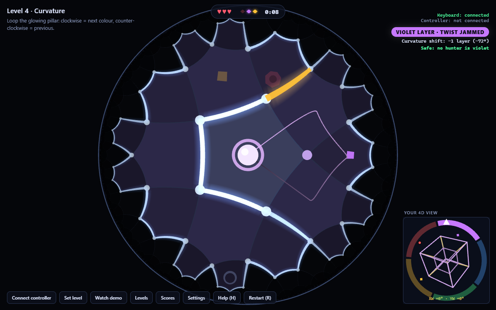
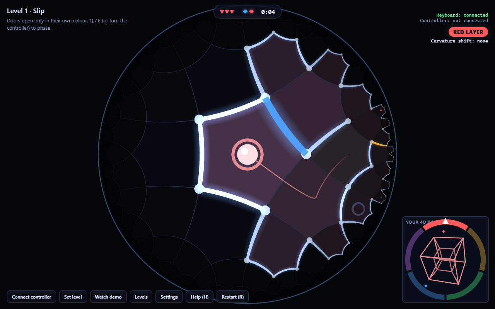
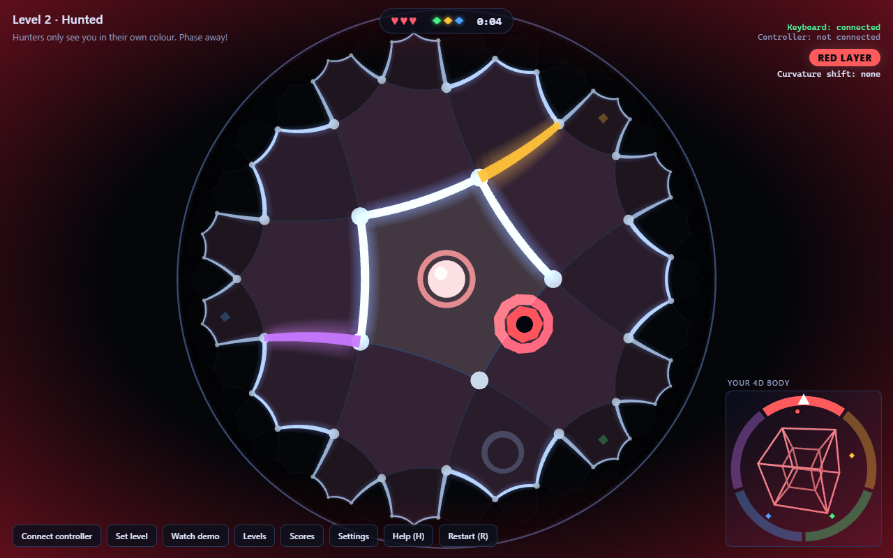
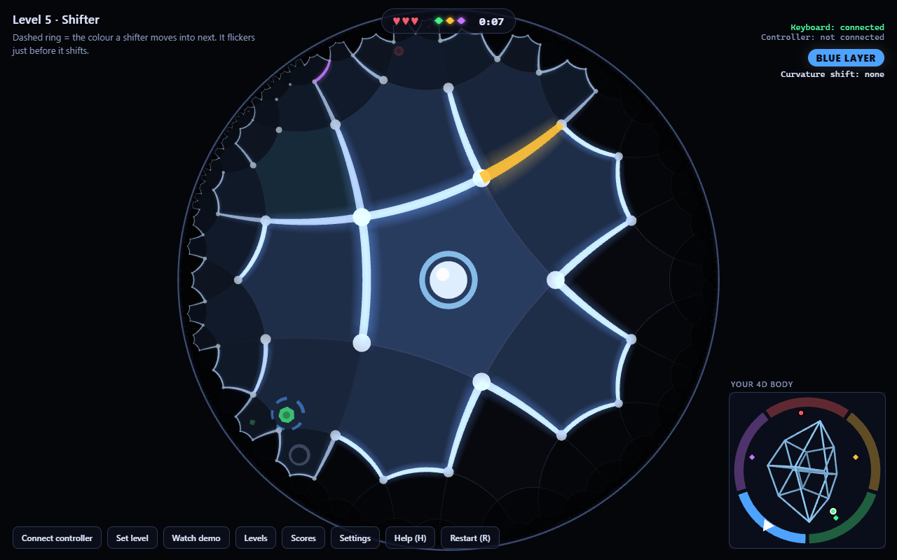
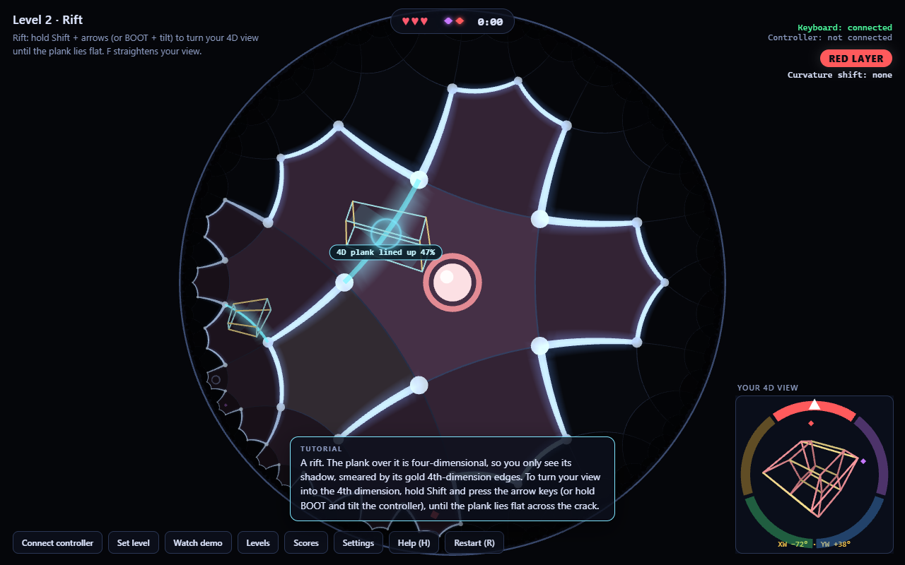

# Phase Escape

**A chase through a maze in curved space with a fourth dimension. Phase between dimensions to slip through doors and lose the hunters, and let the curvature of space shift you too.**

Built for the StormHacks 2026 challenge *Beyond Euclid: Interactive Experiences in Impossible Geometries*, with an optional handheld controller (ESP32 + orientation sensor).



## How it plays

You are a marble in a maze on the **hyperbolic plane**: pentagonal rooms, four meeting at every corner, drawn in the Poincaré disk. Rooms crowd towards the rim because hyperbolic space grows exponentially: there is always more maze ahead.

The maze also has a **fourth dimension**: five layers, five colours. You exist in one layer at a time, and the whole world takes on its colour.

- **Doors** are open only in their own colour. Match it to pass.
- **Shards** ◆ can only be grabbed in their own colour.
- **Hunters** live in one colour. They can only see you, chase you and hit you while you are in their layer; in any other layer they are harmless ghosts. When one closes in, phase out.
- **Shifters** are hunters that change colour on a timetable. A spinning dashed ring shows the colour each one moves into next, and it flickers for a second and a half before it goes.
- **Goal:** collect every shard, then roll into the portal. **Lose:** caught three times. Hunters speed up the longer you take. Finish under par with all lives for three stars.

**Space itself moves you through the fourth dimension.** Roll once around a pillar and you come back one layer over: clockwise goes up a colour, counter-clockwise goes down. That is **holonomy**. The four rooms around a pillar form a square whose corners are 72° instead of 90°, so a lap turns you by its area, 2·180° − 4·72° = 72°, exactly one of the five layers. On the Curvature level (4) twisting is jammed, and loops are the only way through.

| Input | Action |
|---|---|
| Arrows / WASD / drag on the disk | Roll |
| Q / E, Space | Phase down / up one layer |
| Shift + arrows / WASD | Turn your 4D view (the tesseract): left/right in XW, up/down in YW. F straightens it |
| Controller | Tilt to roll; turn it like a dial to phase; tap BOOT = phase up; hold BOOT and tilt = turn your 4D view |
| R · T · M · N · H | Restart · trail · sound · music · help |

**Hunters only hurt you in your own colour.** A hunter that shares your colour can see you: a line joins you to it, the top right says "⚠ 1 red hunter can see you", and touching you costs a life (then you get two seconds of safety). Every other hunter is a faint ghost that can neither see nor touch you. Phasing into a colour with a hunter close by sets off an alarm.

**The tesseract is your view into the fourth dimension** (the corner view). Hold Shift and use the arrows, or hold BOOT and tilt, to turn it in the XW and YW planes. Glowing cracks in the maze are **rifts**. Over each floats a 4D plank, and from where you stand you only see its shadow on the floor, smeared out by its gold fourth-dimension edges. Turning your view moves the shadow. At one angle the w edges fold away and the plank lies flat across the crack, and then it becomes a real bridge. It's a Superliminal-style alignment puzzle, except the hidden direction is w.

**The ring around the tesseract is your colour dial.** The colour wheel is painted on the world; the white pointer is a needle you carry. Q/E turn the needle. A lap round a pillar turns the world 72° relative to you, so the wheel turns under the needle. The help screen (H) and the card after your first lap explain why with a picture. Dots on the wheel are hunters (white outline = shifter); diamonds are shards.

The first three levels have **tutorial tips** that react to what is around you: how to roll, the first door and shard, the first rift, and the first hunter that can see you. Each level keeps a **high-score table** (best five runs, saved in the browser), and the **music** is synthesized live: every layer has its own chord, so phasing changes the harmony, and percussion builds as a hunter in your layer closes in.

**Watch demo** plays the Curvature level by itself: it loops the pillar to change colour without touching the controls.

### Levels

1. **Slip:** learn to phase: two coloured doors, two shards, with tutorial tips.
2. **Rift:** learn to turn your 4D view: two rifts to bridge.
3. **Hunted:** a red hunter, and you start red (tips explain when it can hurt you).
4. **Curvature:** twisting is jammed: loop the pillar to change colour.
5. **Swarm:** 61 rooms, three hunters in three colours.
6. **Shifter:** a hunter that changes colour every 8 s.
7. **Orbit:** twisting is jammed again, in a 61-room maze with three loopable pillars.
8. **Flux:** two shifters going round the colours in opposite directions, and a rift.
9. **Escape:** four hunters; only violet is empty.

Levels 2 and 6–8 come from a **level generator** (`game/src/game/generator.ts`). It puts the exit in the farthest room, coloured doors and rifts along the way, shards in dead ends and hunters in far rooms, and opens laps around chosen pillars. It keeps a level only if the solver proves it fair: finishable, impossible with the doors shut or the rifts unbridged, and (when twisting is jammed) impossible without looping. Recipes live in `src/game/recipes.ts`; `npm run levels` rewrites the JSON.

## Run it

**Play online:** https://dan007b.github.io/phase-escape/. Use Chrome or Edge on any computer, no install needed. The controller connects there too, because GitHub Pages is served over HTTPS. Every push to `main` rebuilds the site (`.github/workflows/pages.yml`).

**Windows desktop app:** `cd desktop`, `npm install`, `npm run package`, then double-click `desktop\out\Phase Escape-win32-x64\Phase Escape.exe`. Copy the whole folder to share it. It finds the controller by itself, over Bluetooth or USB.

**Browser:**

```powershell
cd game
npm install
npm run dev
```

Open http://localhost:5173 in Chrome or Edge (they have Web Bluetooth and Web Serial, which the controller needs). Keyboard and mouse are enough to play.

## The controller (optional)

An ESP32-DevKitC V4 with an Adafruit BNO055 orientation sensor, on four AA batteries, streaming gravity and gyro at 100 Hz over **Bluetooth Low Energy** (or over USB when plugged in). Wiring, power, calibration and both protocols are in [docs/HARDWARE.md](docs/HARDWARE.md). Click **Connect controller**, choose **Bluetooth** (or USB), pick "PhaseEscape", hold the controller the way you want "flat" to be, and click **Set level**. If the wireless link drops, the game reconnects by itself. Tilting rolls the marble; turning the controller about that vertical, like a dial, slides you through the layers (tilting barely affects it, so the two don't fight). Sensitivity and directions are under **Settings**.

```powershell
cd firmware
pio run -t upload
```

## How it works

The full explanation, written for a curious non-expert, is in [docs/MATH.md](docs/MATH.md).

- **Hyperboloid model.** Points satisfy ⟨p,p⟩ = −1 under the Minkowski product; motions are 3×3 Lorentz matrices, all in float64 and re-squared every step.
- **Parallel transport for free.** The marble's velocity lives in its own frame and it moves by M ← M·T(v·dt): exactly parallel transport, so curvature turns its frame with no explicit rotation in the code.
- **Exact holonomy.** Your frame is carried along the geodesics joining room centres, so every loop turns it by exactly the area of a geodesic polygon: 72° per pillar enclosed. A post at every vertex keeps "which side of each pillar" well defined.
- **The fourth dimension is the holonomy group.** Five layers of 72° each: your layer is your twist plus your holonomy, mod 5. Twisting and looping are two ways of moving along the same circle.
- **4D planks.** Your view is L = R_yw(β)·R_xw(α). A plank whose flat view is L₀ is seen turned by M = L·L₀⁻¹, and its shadow on the floor is spanned by the first two rows of M, scaled by the plank's half-extents. The smear (how far that shadow is from the flat rectangle) has a single zero over the ±90° square of views: a test scans every degree.
- **Fair by construction.** A breadth-first solver over (room, holonomy step, twist step, shards held) proves every level can be finished; the autopilot then plays every level along the solver's route with the real physics.
- **Instanced rendering.** Every tile is congruent, so each shape is uploaded once in canonical coordinates. Each instance carries a Lorentz matrix formed on the CPU in float64, and the shader maps it into the disk. The biggest level renders in about 3 ms per frame.

## Project layout

```
desktop/       Electron wrapper: Windows app, picks the controller (Bluetooth or USB) by itself
firmware/      PlatformIO project: ESP32 + BNO055 at 100 Hz over BLE and USB, tools/
game/
  src/math/    pure, tested maths: lorentz, poincare, geodesic, tiling, four
  src/game/    marble, maze, transport (holonomy), phase, hunter, game, levels,
               solver, generator + recipes, tutorial, autopilot
  src/input/   keyboard/mouse, the controller over Web Bluetooth or Web Serial, protocol parsing
  src/render/  Poincaré disk view, 4D view inset, HUD, holonomy figure
  src/         main, sound effects, music, scores, settings
  levels/      the nine levels (JSON)
  tools/       generate-levels.mjs (npm run levels)
  tests/       vitest suites
docs/          MATH.md, HARDWARE.md, DEMO.md, screenshots
```

## Tests

`cd game` then `npm test`. There are 143 tests:
- **Geometry:** isometries, distances, re-orthonormalisation, the disk models, geodesic segments, and the tiling.
- **Holonomy:** one lap around a {5,4} tile turns a transported frame by π/2 to within 1e-9; the room-to-room transport gives ±72° per pillar, and 360° around a tile.
- **Phase Escape:**
  - The rules: doors, hunters (same layer only), lives, and curvature phasing. Shifters follow their timetable and only hit in their current layer. A fuzz test phases in and out around hunters.
  - A state-space solver proving every level is solvable, that every level needs its doors and rifts, and that the twist-jammed levels (4 and 7) cannot be solved without looping.
  - Autopilot playthroughs of every level along the solver's route, with the real physics.
  - The generator: deterministic, only fair levels, a full lap open around every marked pillar, and the level files in sync with their recipes.
  - The tutorial's order of tips, and the high-score ranking.
- **4D maths:** B₄⁺, rotations, the tesseract, and plank shadows (one solution per rift, smear grows with distance from it).
- **Rifts:** they block until bridged, bridge from your 4D view (or settle when you're close and let go), only from nearby, and the solver can require them. BOOT tap vs hold.
- **Controller:** the USB line parser, run against a real 2 s recording from the controller; the Bluetooth packet decoder, and a check that a Bluetooth sample drives the controls exactly as the same sample over USB.

## Screenshots

| | |
|---|---|
|  |  |
|  |  |
|  |  |
|  | |

Regenerate with `?scene=title|doors|hunted|curvature|rift|shifter|final` (headless Chrome at 1280×800). The two-minute demo script is in [docs/DEMO.md](docs/DEMO.md).

## Why a lap changes your colour

You carry a needle that you never turn. Walk once round the four rooms of a pillar. In flat space a square has 90° corners: you turn 4 × 90° = 360° and the needle comes back exactly as it was. Here the corners are 72°, so you turn 108° at each corner, 432° in all, which is a full turn plus 72°. You end up facing the way you started, but the needle is 72° off. That's holonomy (§7 of MATH.md), and 72° is exactly one of the five colours.

Between two points there is exactly one straight path here, just as in flat space (on a sphere there can be many). What curvature changes is how you arrive: two different routes to the same room bring you there turned by 72° for every pillar between them.

## History

This started as "The Key and the Curve", a puzzle about matching a tesseract key's 4D orientation ([CLAUDE.md](CLAUDE.md) has the original brief). Playtesting showed it was vague and too hard, with no way to lose, so it became Phase Escape. The hyperbolic engine, the controller and the exact holonomy carried over; the fourth dimension became something you move through, not something you decode. Later the tesseract came back as your 4D view, with a clearer job: line up a plank's shadow until it lies flat, with the plank itself showing you how close you are.
