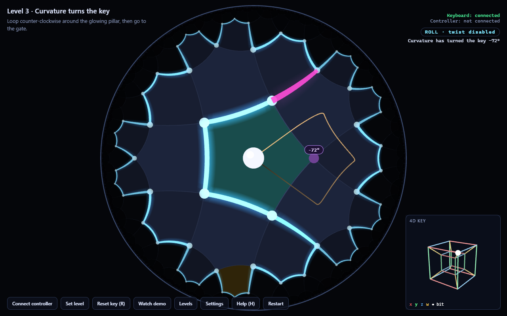
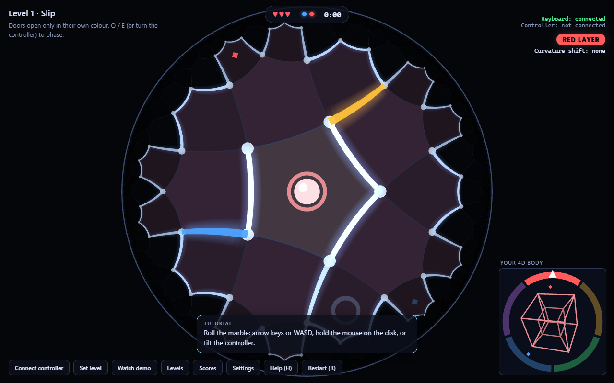
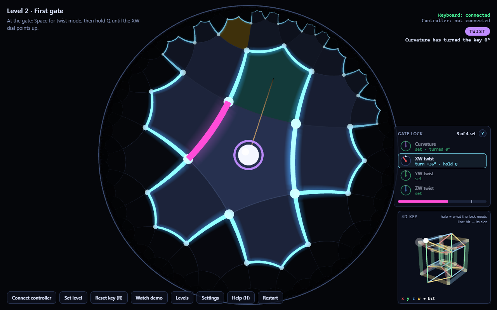
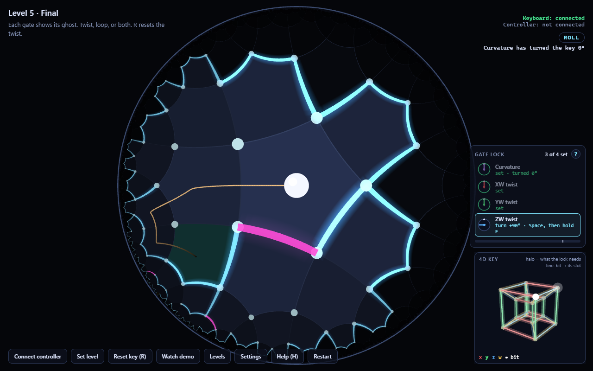

# The Key and the Curve

**Roll a marble through a maze in curved space, carrying a four-dimensional key. In curved space, the path you take changes the object you carry.**

Built for the StormHacks 2026 challenge *Beyond Euclid: Interactive Experiences in Impossible Geometries*.



## The idea

The maze is laid out on the hyperbolic plane, tiled by pentagons with four meeting at every corner (the {5,4} tiling), and drawn in the Poincaré disk. The view is always centred on the marble, so rooms near you look big and rooms further away crowd towards the rim. There is far more room out there than a flat map would suggest: in hyperbolic space, area grows exponentially with distance.

A tesseract floats with the marble. It is the key. Magenta gates open only when the key is in the right orientation, and you can turn it in two ways:

1. **Twist it through the fourth dimension.** Press Space (or the controller's BOOT button) and turn it in the XW, YW and ZW planes. With the controller, you literally rotate your wrist and the key turns through 4D.
2. **Let space turn it.** Roll once around a pillar and you come back with the key, and the whole maze around you, turned by exactly 72°. Nothing twisted it; the curvature of space did. This is **holonomy**, and some gates can only be opened this way.

## Play

**Desktop app (Windows).** Build it once, then just double-click it:

```powershell
cd desktop
npm install
npm run package
```

This creates `desktop\out\The Key and the Curve-win32-x64\The Key and the Curve.exe`. Copy that whole folder anywhere (or zip it to share); it needs nothing else installed. The app finds the ESP32 controller's port by itself when you click **Connect controller**. For a quick run without packaging, use `npm start` in `desktop`.

**In the browser:**

```powershell
cd game
npm install
npm run dev
```

Open http://localhost:5173 in Chrome or Edge (they have Web Serial, which the controller needs). Everything works with keyboard and mouse; the controller is optional.

| Input | Action |
|---|---|
| Arrow keys, WASD, or drag on the disk | Tilt the board to roll the marble |
| Space · controller BOOT button | Toggle twist mode |
| Q / A, W / S, E / D | Twist the key in the XW, YW, ZW planes (in twist mode, or with Shift) |
| Tilt / rotate the controller | Roll the marble / twist the key (in twist mode) |
| R | Reset the key (undo all twists) |
| T · M · H | Trail on/off · sound on/off · help |

The inset in the corner shows the key. Edges are coloured by axis (x red, y green, z blue, w gold) and one corner, the key's **bit**, is a white bead.

Each gate is a **4D lock with four dials**, shown in the lock panel above the key when you reach a gate:
- **Curvature:** only rolling around pillars changes it. The panel says how many laps, and which way.
- **XW, YW, ZW:** the twist planes. Each dial says how far to turn and which key to hold, for example "turn +48° · hold Q".

When every dial points straight up, the key matches the gate's ghost (the translucent halo behind it, with a dashed line from the bit to its slot) and the gate opens. Get close and let go: the key slides in by itself. The **?** on the lock panel explains it all with pictures. It also appears automatically at your first gate.

**Watch demo** plays level 3 by itself: it rolls straight to the gate (no fit), loops the glowing pillar, and comes back with the key turned.

### Levels

1. **Rolling.** Learn to tilt; notice the rooms shrinking towards the rim.
2. **First gate.** A 90° twist in the XW plane.
3. **Curvature turns the key.** Twisting is disabled. The only way through is to loop a pillar counter-clockwise, which turns the key by −72°. The obvious shortcut turns it +72°, the wrong way.
4. **Combine.** A 4D twist plus a curvature turn, the other way round.
5. **Final.** Three gates, 61 rooms. The key remembers every twist and every loop.

## The controller (optional)

An ESP32-DevKitC V4 with an Adafruit BNO055 orientation sensor, streaming fused orientation, gravity and gyro rate at 100 Hz over USB. Wiring, calibration, the serial protocol and troubleshooting are in [docs/HARDWARE.md](docs/HARDWARE.md).

```powershell
cd firmware
pio run -t upload
pio device monitor
```

In the game, click **Connect controller** and pick the board's port, hold the controller the way you want "flat" to be, and click **Set level**. The BOOT button toggles twist mode. Tilt direction, sensitivity, deadzone and the wrist-to-4D-plane mapping are adjustable under **Settings**.

## How it works

The full explanation, written for a curious non-expert, is in [docs/MATH.md](docs/MATH.md). In short:

- **Hyperboloid model.** Points are vectors with ⟨p,p⟩ = −1 under the Minkowski product; motions are 3×3 Lorentz matrices. Everything is computed in float64 and re-squared every step, so nothing drifts.
- **Parallel transport for free.** The marble's velocity lives in its own frame, and it moves by M ← M·T(v·dt). That is exactly parallel transport along the geodesic it rolls on, so curvature rotates its frame without any explicit rotation in the code.
- **72° per pillar, exactly.** The key is carried along the chain of geodesics joining room centres, so every loop turns it by exactly the area of a geodesic polygon: 72° for each pillar enclosed. A post at every maze vertex keeps "which side of each pillar" well defined.
- **A key must not be symmetric.** The tesseract's 192 rotational symmetries include every 90° plane rotation, so an unmarked tesseract would "fit" a 90° twist without being turned. The coloured axes and the bead break that symmetry.
- **Instanced rendering.** Every tile is congruent, so each shape is uploaded once in canonical coordinates. Each instance carries a Lorentz matrix formed on the CPU in float64, and the vertex shader maps it into the disk. The largest level renders in about 5 ms per frame.

## Changes from the original brief

The project brief is in [CLAUDE.md](CLAUDE.md). Two of its ideas turned out not to work as written, and were fixed:

| Brief | Problem | What the game does |
|---|---|---|
| The key is transported in the marble's own frame; one lap around a tile turns it 90° | The rotation equals the area enclosed by the marble's actual path, which varies by about a radian depending on how it hugs the walls. That is far too noisy for a ~14° gate tolerance. | The key is carried along geodesics between room centres. Loops then turn it by exact multiples of 72° (one per pillar, the area of the dual {4,5} square). |
| Gates compare the key up to the tesseract's symmetry group B₄⁺ | B₄⁺ contains every 90° plane rotation, so a 90° twist target is met by an untouched key, and 90° curvature turns are invisible. | The key is marked (coloured axes, one marked corner) and compared without symmetry. A test demonstrates the problem. |

Hardware changes made during the build: a classic ESP32 (DevKitC V4) instead of an ESP32-S3, so serial goes through a USB-UART bridge at 921600 baud; the BOOT button is the only button and toggles twist mode; the BNO055 is initialised with a clock-settling delay that fixed a real start-up failure.

## Project layout

```
desktop/             Electron wrapper: Windows app with automatic controller port selection
firmware/            PlatformIO project: ESP32 + BNO055 at 100 Hz
  src/main.cpp
  tools/             check_stream.py, calibrate.py, nvs_dump.py
game/                Vite + TypeScript (strict) + Three.js 0.186.1
  src/math/          pure, tested maths: lorentz, poincare, geodesic, tiling, four
  src/game/          marble physics, mazes, transport, levels, gates, autopilot
  src/input/         keyboard/mouse, Web Serial controller, protocol parsing
  src/render/        Poincaré disk view, 4D key inset, HUD
  levels/*.json      the five levels
  tests/             vitest suites
docs/                MATH.md, HARDWARE.md, DEMO.md, screenshots
```

## Tests

```powershell
cd game
npm test
```

118 tests, including:
- **Geometry:** Lorentz inverse, invariance of distances, re-orthonormalisation, the disk staying strictly inside the unit circle, Klein straightness, wall segment tests, and the tiling's neighbour structure.
- **Holonomy:** one lap around a {5,4} tile turns a transported frame by π/2 to within 1e-9, and regular polygons of every shape match −area.
- **The game's transport:** ±72° per pillar by orientation, 360° around a whole tile, and exact results after 5,000 random steps.
- **The 4D key:** B₄⁺ has 192 elements, is closed, and is orthogonal with det 1; twist exactness and the fit metric.
- **Levels:**
  - a state-space solver proves every level is solvable, and that levels 3 and 4 cannot be solved without looping;
  - an autopilot plays every level from start to goal with the real physics and gate code, using only tilt and twist input.
- **Controller:** the parser, run against two seconds recorded from the real controller.

The math layer never imports Three.js; a test enforces that.

## Screenshots

| | |
|---|---|
|  |  |
|  |  |

To regenerate them, open the game with `?scene=title`, `gate`, `loop` or `final`.

A two-minute demo script is in [docs/DEMO.md](docs/DEMO.md).
